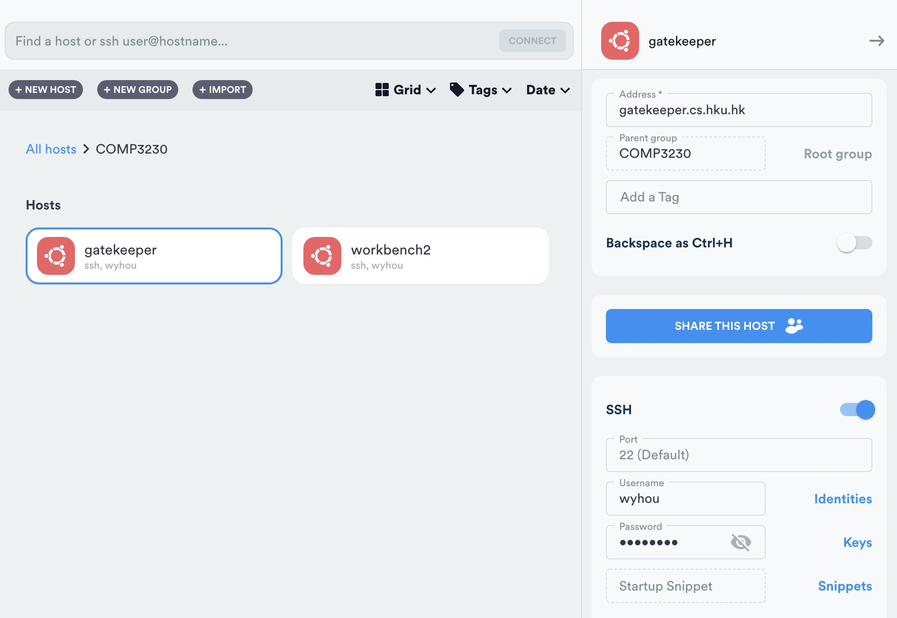
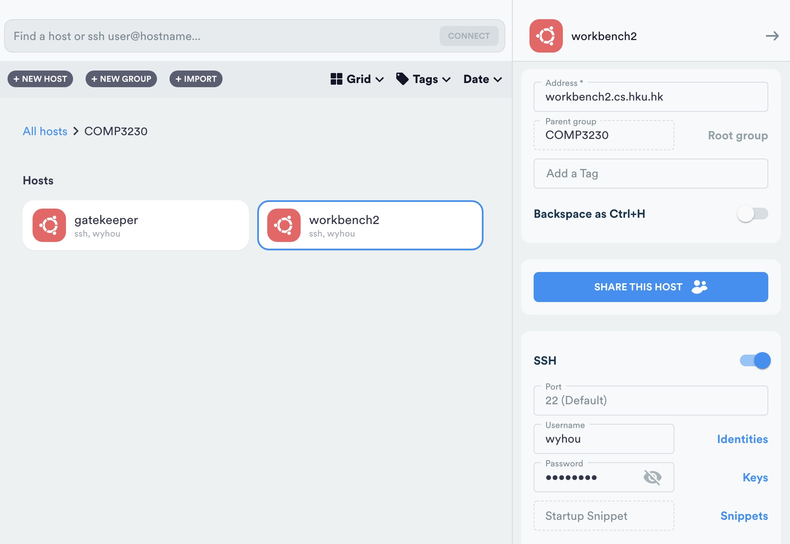
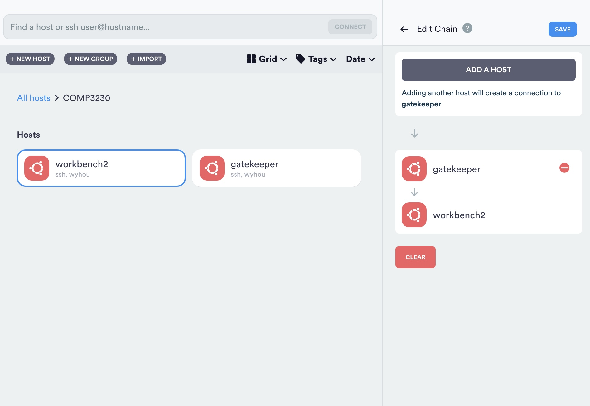

# Tutorials on how to config vscode and termius
This is the text verison tutorial on how to config vscode and termius. In case some of you prefer a PDF version guide.

## vscode
Steps:
0. Download vscode from [here](https://code.visualstudio.com/download)
1. install the extension "Remote - SSH" from the extension tab
2. open the command palette (ctrl+shift+p) and type "Remote-SSH: Connect to Host..." or click the green button on the bottom left corner
3. choose "Open configuration file" and add the following lines to the file (replace \<your-username\> with your username.)
4. save the file and connect to the server by clicking the green button on the bottom left corner and choose "Connect current window to host" then choose the server you want to connect to (shown server name should be workbench2, if you reuse configuration below).

```
Host gatekeeper
  HostName gatekeeper.cs.hku.hk
  User <your-username>

Host workbench2
  HostName workbench2.cs.hku.hk
  User <your-username>
  ProxyJump gatekeeper
```


## termius
Steps:
0. Download termius from [here](https://termius.com/download)
1. Click the `new host` button
2. Create SSH to gatekeeper. Fill in the `host name`, `user name`, `password` and `port` (if you are using the default port, you can leave it blank)
3. Repeat step 2 to create SSH to workbench2. 
4. click `chain edit` button to connect gatekeeper and workbench2
5. Double click workbench2 to connect to workbench2, via ProxyJump gatekeeper.



